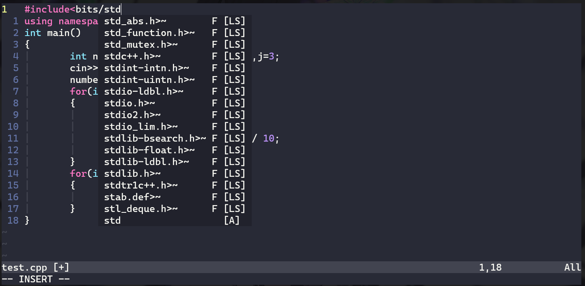

# neovim_c/c++_ide_vim_init.vim
This init.vim file can be used to turn your neovim like a ide for c++ development

vim is a ide that can make your work-flow better but setting it up is not easy this is why this repo is game to setup vim for c/c++ programing 
vim is great for competivite programming but with this setup you could use its like VScode(well there is still some differcences but its better than plan vim)

# Requirement
* neovim (the better version of vim) you can get neovim from here https://github.com/neovim/neovim
* vim-plug(this is to install plugins) you can get it from here https://github.com/junegunn/vim-plug
* You must locate you init.vim file if you didnt set it up you can do the following:-
      * cd ~/.config/nvim/ and the touch init.vim
* Go in there and paste the following:- 
___________________________________________________________________________________________________________________
      call plug#begin() 
      Plug 'preservim/nerdtree' 
      Plug 'neoclide/coc.nvim' 
      Plug 'dracula/vim' 
      Plug 'zchee/deoplete-jedi' 
      call plug#end() 
___________________________________________________________________________________________________________________
     now all these are plugins to make your nvim better. You can read more about them in detail over here 
     https://github.com/preservim/nerdtree 
     https://github.com/neoclide/coc.nvim 
     https://github.com/dracula/vim 
     https://github.com/deoplete-plugins/deoplete-jedi 
* Before you go ahead you most have nodejs and clangd for c/c++ auto complete to work so go on write :w and then :source % and :wq
if by chance you dont have nodejs you can easliy install in by sudo apt install nodejs for ubuntu
if you dont have clangd then you can install it following this guide https://clangd.llvm.org/installation.html 
* After that you can just write :CocInstall coc-clangd and you c++\c should be working after you :w and :source % again 
* Now you can copy and paste the remaining lines 
_______________________________________________________________________________________________________________________
if(has("termguicolors")) 
        set termguicolors 
endif 
syntax enable 
colorscheme dracula 
set number 
set relativenumber 

" use <tab> for trigger completion and navigate to the next complete item 
" function! s:check_back_space() abort 
"   let col = col('.') - 1 
"     return !col || getline('.')[col - 1]  =~ '\s' 
"     endfunction 
" 
"     inoremap <silent><expr> <Tab> 
"           \ pumvisible() ? "\<C-n>" :
"                 \ <SID>check_back_space() ? "\<Tab>" : 
"                       \ coc#refresh() 
      
inoremap <expr> <Tab> pumvisible() ? "\<C-n>" : "\<Tab>" set mouse=a 
let g:NERDTreeMouseMkde=3 

set listchars=tab:\|\ 
set list 
set noswapfile 
set incsearch 
set noswapfile 
set nobackup 

set foldmethod=syntax 
set foldlevel=1 
set foldlevelstart=1 
set nofoldenable 

set mouse=a 
let g:NERDTreeMouseMode=3 

let mapleader = "," 
inoremap <expr> <Tab> pumvisible() ? "\<C-n>" : "\<Tab>" 
nnoremap <leader>h :wincmd h<CR> 
nnoremap <leader>j :wincmd j<CR> 
nnoremap <leader>k :wincmd k<CR> 
nnoremap <leader>l :wincmd l<CR> 
nnoremap <leader>n :NERDTreeToggle<CR> 
set winheight=38 
nnoremap <leader>t :wincmd b\| bel terminal<CR> 
__________________________________________________________________________________________________________________________
  
 these lines give to a better vim experince you could easly change things like you leader key is you want by defalt in  these you new leader key = ","
 know if you :w :source :wq
 and open a c\c++ file with the .c or .cpp extension your auto complete most be working if everthing has be done right 
 # This is what you neovim should look like
 
 
